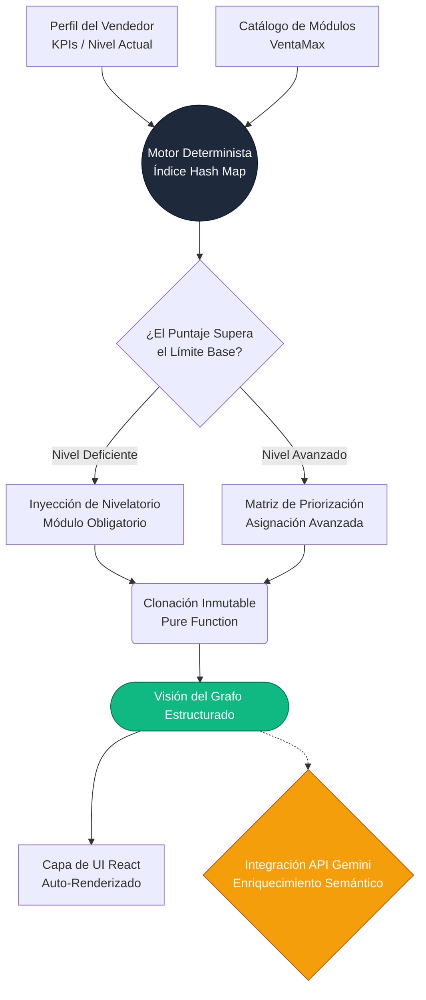

# DOCUMENTO DE DECISIONES DEL ALGORITMO DE CRUCE

**Proyecto:** Kometa Learning Engine - VentaMax
**Rol Técnico:** Arquitecto de Software Senior
**Alcance:** Resumen Ejecutivo (1 Página)

---

## 1. Topología del Sistema: Árbol de Decisión Ponderado

Para resolver el desafío comercial de cruzar el perfil del vendedor con el catálogo formativo, se descartaron las iteraciones anidadas. En su lugar, implementamos un **Árbol de Decisión basado en Índices Hash con Búsquedas en $O(1)$**. 

A continuación, la arquitectura del flujo de datos (*Data Flow*):

*Trade-off Arquitectónico:* El motor procesa la lógica en la RAM del cliente (Front-End). Esto otorga una experiencia *Zero-Latency*, pero asume el compromiso de exponer temporalmente las reglas de negocio en el navegador. Se asume como un riesgo aceptable dado que el catálogo de VentaMax mantiene un límite de *payload JSON* ligero bajo los 5MB, evitando la saturación de memoria en dispositivos móviles.

---

## 2. Decisiones Clave de Ingeniería

Este Algoritmo de Cruce ("Matching Engine") se fundamenta en tres decisiones técnicas innegociables:

### Decisión 1: Aislamiento Lógico del LLM (Determinismo Comercial)
* **La Estrategia:** Limitar la injerencia probabilística de la IA en datos transaccionales.
* **El Impacto Técnico:** Modelos como Gemini calculan respuestas de manera estocástica, lo que introduce el riesgo de *alucinación* sobre reglas estrictas de VentaMax. Optamos por delegar la inferencia central a funciones deterministas locales en JavaScript (una entrada produce siempre la misma salida). El LLM se desacopla del *core* y actúa únicamente como validador asíncrono y enriquecedor de lenguaje natural, garantizando el 100% de fiabilidad en el Service Level Agreement.

### Decisión 2: Tramos a Tiempo Constante (De $O(N^2)$ a $O(1)$)
* **La Estrategia:** Implementación de *Hash Maps* sobre estructuras vectoriales tradicionales.
* **El Impacto Técnico:** Un cruce relacional estándar requiere iterar perfiles contra inventarios de módulos, generando una complejidad temporal cuadrática $O(N^2)$. Al indexar previamente el catálogo de módulos por ID semántico, el motor permite inserciones y lecturas directas en la matriz de pesos con un esfuerzo computacional promedio de $O(1)$.

### Decisión 3: Rigidez de Flujo y Mutaciones Cero
* **La Estrategia:** Arquitectura de estado inquebrantable mediante *Deep Cloning*.
* **El Impacto Técnico:** Rediseñar la lógica alrededor de integraciones puras funcionales evita los *side-effects* traidores durante los re-renderizados de React. Cada usuario que cruza el algoritmo produce un grafo de memoria nuevo, sin sobreescribir la *Single Source of Truth* global. Esto resulta en ciclos de hidratación de componentes fiables y depurables independientemente del escalamiento masivo de usuarios.
